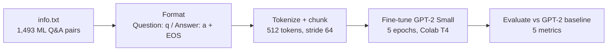

# ML-DriftNet: Domain Adaptation of GPT-2 Through Structured Q&A Fine-Tuning

Master's project, DSC 550, University of Massachusetts Dartmouth, Spring 2026 (team project).
**Project lead:** Rugwesh Reddy Gankidi. **Mentor and advisor:** Dr. Amir Akhavan Masoumi.

The project asks a simple question: does fine-tuning a small pre-trained language model on structured,
domain-specific question-and-answer pairs produce measurable domain adaptation? GPT-2 Small (124M parameters) is
fine-tuned on machine-learning Q&A pairs and compared with the original GPT-2 on five evaluation metrics.



## Training setup

| Setting | Value |
|---|---|
| Base model | `gpt2` (GPT-2 Small, 124M parameters) |
| Training data | First 700 of 1,493 Q&A pairs (45,471 tokens, 704 chunks of 512 tokens, stride 64) |
| Held-out data | Pairs 701-720, never used in training (Metric 1) |
| Optimizer | AdamW, lr 3e-5, weight decay 0.01, cosine schedule with 10% warm-up |
| Batch | 8 x 4 gradient-accumulation steps = effective batch 32 |
| Stability / memory | Gradient clipping 1.0, fp16 autocast + GradScaler, gradient checkpointing |
| Hardware / time | Google Colab T4 GPU, about 4.5 minutes for 5 epochs |
| Training loss | 3.64 (epoch 1) -> 2.63 (epoch 5) |

## Results (from the notebook run)

| # | Metric | GPT-2 baseline | Fine-tuned | Evaluation set |
|---|---|---|---|---|
| 1 | Perplexity on held-out Q&A | 72.85 | **31.83** (56.1% lower; better on 20/20) | 20 held-out pairs |
| 2 | Multiple-choice answer ranking | 4/15 (26.7%) | **13/15 (86.7%)** | 15 questions, 4 options each |
| 3 | Log-probability per token | -4.48 | **-2.92** (higher on 20/20) | 20 ML Q&A pairs |
| 4 | Embedding separation (MiniLM) | - | gap 0.357 | 15 ML vs 5 off-topic sentences |
| 5 | Generated-answer similarity to ground truth | 0.331 | **0.532** (better on 8/10) | 10 questions, greedy decoding |

Off-topic control: on five unrelated sentences, perplexity moved between -37% and +27% per sentence
(about 10% higher on average), so the change was not limited to ML text.

## How to read these results

- **Metric 1 is the cleanest evidence of adaptation.** It uses 20 pairs that were never in the training data,
  and the fine-tuned model has lower perplexity on every one of them.
- **Metrics 2, 3 and 5 mostly reuse questions that also appear in the training data** (11 of 15, 15 of 20 and
  8 of 10 respectively), so they show that the model absorbed the training content more than they show
  generalization to new questions.
- **Metric 4 does not involve GPT-2.** It embeds fixed hand-written sentences with `all-MiniLM-L6-v2`, so it checks
  that the embedding model used in Metric 5 separates ML text from off-topic text; it is a sanity check of the
  evaluation setup, not a measure of the fine-tuned model.
- The notebook's pass/fail rules are relative to the baseline (for example, Metric 1 passes above a 10% perplexity
  reduction, Metric 5 when the fine-tuned average beats the baseline by more than 0.03). All five passed.

## Run it

1. Open `notebooks/ML_DriftNet_Colab.ipynb` in Google Colab (**File -> Upload notebook**, or open it from GitHub).
2. **Runtime -> Change runtime type -> T4 GPU**.
3. Run the cells in order. When Cell 4 asks for a file, upload `data/info.txt` from this repository.
4. Training takes about 5 minutes; the evaluation cells print each metric, draw the charts and export CSV files and an
   HTML summary.

## Repository layout

```
notebooks/ML_DriftNet_Colab.ipynb   training + all five metrics, with the outputs of the reported run
data/info.txt                       1,493 machine-learning Q&A pairs ("Q: ... / A: ...")
requirements.txt                    packages for running outside Colab
```

## Future work

- Evaluate on a larger held-out set and build multiple-choice and generation tests only from held-out questions.
- Compare full fine-tuning with parameter-efficient methods (LoRA / QLoRA) and larger models.
- Measure forgetting on standard benchmarks instead of five off-topic sentences.

## Acknowledgments

Sincere thanks to **Dr. Amir Akhavan Masoumi** for mentoring this project, especially the design of the
five-metric evaluation framework.

## License

MIT
